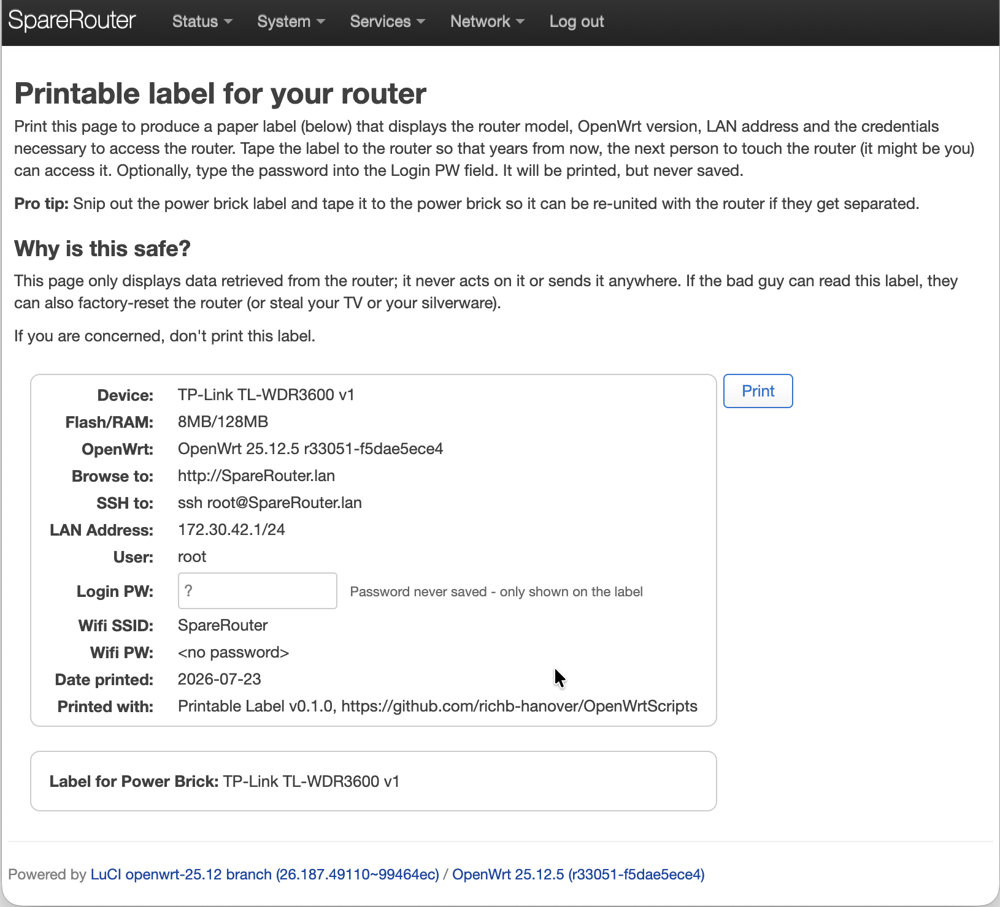

# Printable Label

This package displays a web page that, when printed,
creates a label with router info plus credentials
that can be taped to the router for ease of access
when you come back to the router years from now.

To display the label, choose **Services -> Printable Label**.
The border (below) contains the information that
is printed for the label.



-------

Displays the same router-identification "label" that `print-router-label.sh`
(in the repo root) prints to the console, but in the LuCI web GUI under
**Services → Printable Label**. The root login password isn't derivable from
`uci`, so it's a plain text field on the page — nothing typed there is
saved to disk or sent to the router; it only updates the page you're looking at.

Two ways to run this: a real installable `.apk`, built and deployed with
`./build-apk.sh && ./deploy-apk.sh` (fast — no OpenWrt SDK needed, see
[BUILDING.md](./BUILDING.md)), or a manual loose-file deploy for iterating
on a single file (below). See
`docs/superpowers/specs/2026-07-18-luci-app-router-label-design.md` for
the original design rationale.

## Architecture note: targets ucode-era LuCI, not classic Lua LuCI

Current OpenWrt (confirmed on a 2026-dated snapshot build, OpenWrt 25.12.5)
has fully migrated LuCI's controller layer from Lua to ucode, and dropped
`/usr/lib/lua/luci` entirely. Third-party apps in this LuCI version don't
ship their own controller code at all — menu entries are plain JSON files
in `/usr/share/luci/menu.d/`, and JS views fetch data directly via LuCI's
existing client-side `fs`, `uci`, and `rpc` JS modules (the same modules
`luci-app-sqm`'s `sqm.js` uses), gated by an ACL file in
`/usr/share/rpcd/acl.d/`. There is no controller in this app for that
reason — all the logic that used to live in a Lua controller now lives in
`htdocs/luci-static/resources/routerlabel.js`, loaded by the view via
`'require routerlabel'`.

An earlier version of this app used a Lua controller + `luasrc/` module;
that approach doesn't work on current OpenWrt and was removed.

## Testing on a router

**Recommended:** `./build-apk.sh && ./deploy-apk.sh [user@]router-address`
from this directory — builds the `.apk` (see [BUILDING.md](./BUILDING.md))
and installs it on the router with `apk`, clearing the menu cache and
restarting `rpcd` for you.

## Manual loose-file deploy (fallback / single-file iteration)

Useful for iterating on a single file, or if something's gone wrong with
the packaged path above — no package involved, just `scp` the file straight
to where it runs. Copy the files directly onto a router running current
OpenWrt. The `scp`
source paths below are relative to this directory (`luci-app-router-label/`),
so `cd` here first.

**Note the `-O` flag on each `scp`:** OpenWrt's default SSH server (Dropbear)
doesn't ship an `sftp-server` binary, and modern `scp` clients (OpenSSH 9.0+,
which is what current macOS ships) default to the SFTP protocol. Without
`-O` you'll hit `ash: /usr/libexec/sftp-server: not found` / `scp: Connection
closed`. `-O` forces the older SCP protocol, which Dropbear does support.

```bash
cd luci-app-router-label   # skip if you're already in this directory

ssh root@<router> mkdir -p /usr/share/luci/menu.d /usr/share/rpcd/acl.d \
	/www/luci-static/resources/view

scp -O htdocs/luci-static/resources/routerlabel.js \
	root@<router>:/www/luci-static/resources/routerlabel.js
scp -O htdocs/luci-static/resources/view/routerlabel.js \
	root@<router>:/www/luci-static/resources/view/routerlabel.js
scp -O root/usr/share/luci/menu.d/luci-app-router-label.json \
	root@<router>:/usr/share/luci/menu.d/luci-app-router-label.json
scp -O root/usr/share/rpcd/acl.d/luci-app-router-label.json \
	root@<router>:/usr/share/rpcd/acl.d/luci-app-router-label.json

# Menu cache and rpcd (for the ACL file) both need a kick to pick up new files
ssh root@<router> rm -f /tmp/luci-indexcache*
ssh root@<router> /etc/init.d/rpcd restart
```

Then reload LuCI in your browser and look under **Services → Printable Label**.
If the menu entry doesn't show up, double check the menu cache was cleared
and `rpcd` actually restarted (`logread | grep rpcd` can help). Root/admin
sessions typically bypass ACL checks entirely, so the ACL file mainly
matters for non-root delegated admin accounts — but ship it anyway, since
every other app here does, and it's what makes this a properly-packaged
app rather than something that only works for `root`.

## Mock data for local development

Once the page is deployed and loading, append `?mock=1` to its URL (e.g.
`.../admin/services/routerlabel?mock=1`) to see fixed sample values instead
of real ubus/uci/`/proc/mtd` data. Useful for iterating on layout/styling
without needing to reconfigure wifi or uci each time. No redeploy needed
to toggle it -- just edit the URL. The mock values live in `getMockData()`
in `htdocs/luci-static/resources/view/routerlabel.js`.

This can't eliminate the need for a router entirely: the page still runs
inside LuCI's own JS framework (`E()`, `_()`, `view.extend`, etc.), which
only exists once a real router has loaded it — there's no standalone/local
way to preview this page outside LuCI.

## Known divergence from print-router-label.sh

When no wifi-iface is enabled, this page shows Wifi SSID/PW as `unknown`/
`unknown`, matching the design spec's documented intent. The shell script's
own fallback for this case (`print-router-label.sh`'s `else` branch) is
actually unreachable — its `mktemp` creates `$TMPFILE` before the loop
runs, so `[ -f "$TMPFILE" ]` is always true, and the script really prints
an empty SSID and `<no password>` in this case. This page's behavior is
the documented intent working as designed, not a bug — just a heads up
if you're comparing outputs side by side on a router with no enabled
wifi-iface.

## Running the unit tests locally

`htdocs/luci-static/resources/routerlabel.js` has no LuCI/browser
dependencies and can be tested with plain `node` — no router needed:

```bash
cd ../tests
node test_routerlabel_util.js
```
